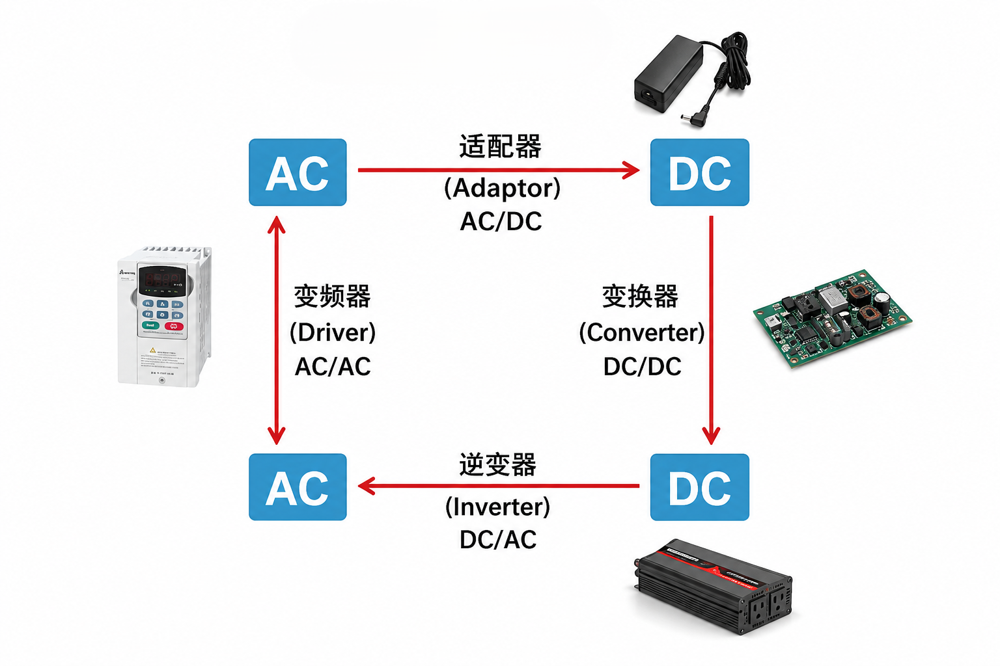
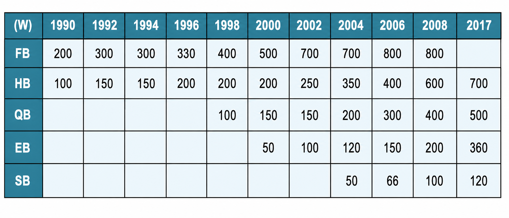

+++
date = '2026-07-11T14:37:37+08:00'
draft = false
title = '开关电源设计p1-p3'
+++

## 电源与负载  

| 转换形式 | 转换方向 | 常见设备 | 主要作用 |
| :---: | :---: | :--- | :--- |
| AC/DC | 交流转直流 | 电源适配器、开关电源 | 将市电转换为直流电 |
| DC/DC | 直流转直流 | Buck、Boost 电源模块 | 升压、降压或稳压 |
| DC/AC | 直流转交流 | 逆变器 | 输出交流电 |
| AC/AC | 交流转交流 | 变频器 | 调节交流电压和频率 |

如表所示，该图展示了电力电子系统中常见的四种电能转换形式，主要包括  
**AC/DC、DC/DC、DC/AC 和 AC/AC** 四种。

**AC/DC 转换**
交流电经过适配器或开关电源转换后，可以得到稳定的直流电。  

**DC/DC 转换**
直流电还可以通过 DC/DC 变换器调整电压等级，以满足不同电子设备的供电需求。  

**DC/AC 转换**  
逆变器则能够把直流电转换为交流电，实现 DC/AC 转换。  

**AC/AC 转换**
变频器可以对交流电的电压和频率进行调节。  

> **说明：** 图中的电源适配器、DC/DC 电源模块、逆变器和变频器，分别对应上述四种典型的电能转换设备。  
---

  

如表所示，这张图与“开关电源设计”关系最密切的部分主要是 AC/DC 变换和 DC/DC 变换。AC/DC 开关电源负责将市电转换为直流电，而 DC/DC 开关电源则负责对直流电压进行升压、降压或稳压处理。  

## 对电源的要求  

### 一、电源为什么重要

在电子系统中，电源负责把输入电能转换为负载所需要的电压和电流。虽然电源通常不直接参与数据处理或控制运算，但它会影响整个系统能否稳定工作。

对于处理器、通信设备、工业控制系统和服务器等设备来说，负载电流可能在很短时间内发生较大变化。如果电源的输出能力不足，可能会出现输出电压下降、系统复位、芯片工作异常，甚至器件损坏等问题。

因此，电源设计不能只关注“能否输出所需电压”，还需要综合考虑效率、功率密度、可靠性、成本、体积以及动态响应等指标。  

### 二、电源模块的发展趋势

  

如图展示了不同封装尺寸 DC/DC 电源模块输出功率的发展变化，其中：

- FB 表示 Full Brick，即全砖模块；
- HB 表示 Half Brick，即半砖模块；
- QB 表示 Quarter Brick，即四分之一砖模块；
- EB 表示 Eighth Brick，即八分之一砖模块；
- SB 表示 Sixteenth Brick，即十六分之一砖模块。

从图中的数据可以看出，随着电源技术的发展，相同尺寸电源模块能够提供的输出功率不断提高。

例如，半砖模块的输出功率由早期的约 100 W，逐渐提高到 700 W；四分之一砖模块也从约 100 W 提升到 500 W。八分之一砖和十六分之一砖模块虽然体积更小，但输出功率也在持续增加。

这说明电源模块正在向以下方向发展：

> 更小的体积、更高的输出功率和更高的功率密度。

功率密度通常可以表示为：

$$
\rho_P = \frac{P_{\mathrm{out}}}{V}
$$

式中：

- $\rho_P$ 为功率密度；
- $P_{\mathrm{out}}$ 为电源输出功率；
- $V$ 为电源模块所占体积。

在输出功率相同的情况下，电源体积越小，功率密度越高。但体积减小后，散热、电磁干扰和器件布局等问题也会更加明显。
