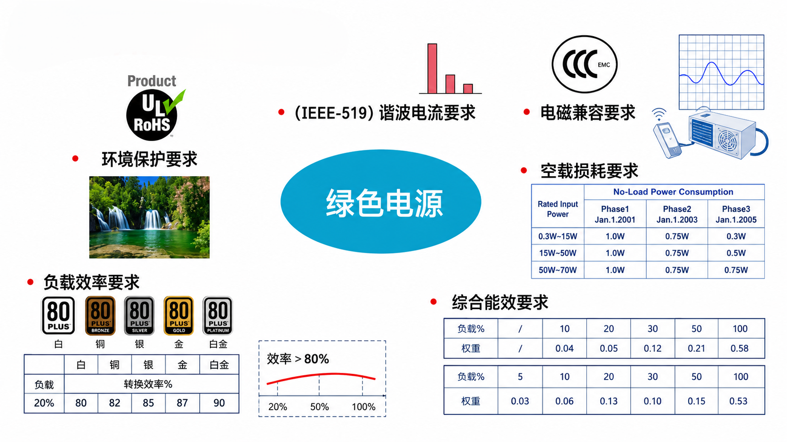

+++
date = '2026-07-11T14:37:37+08:00'
draft = false
title = '开关电源设计p1-p3'
math = true
+++

## 电源与负载  

表1 电能形式的转换
  

| 转换形式 | 转换方向 | 常见设备 | 主要作用 |
| :---: | :---: | :--- | :--- |
| AC/DC | 交流转直流 | 电源适配器、开关电源 | 将市电转换为直流电 |
| DC/DC | 直流转直流 | Buck、Boost 电源模块 | 升压、降压或稳压 |
| DC/AC | 直流转交流 | 逆变器 | 输出交流电 |
| AC/AC | 交流转交流 | 变频器 | 调节交流电压和频率 |  

如表1所示，该图展示了电力电子系统中常见的四种电能转换形式，主要包括  
**AC/DC、DC/DC、DC/AC 和 AC/AC** 四种。

**AC/DC 转换**
交流电经过适配器或开关电源转换后，可以得到稳定的直流电。  

**DC/DC 转换**
直流电还可以通过 DC/DC 变换器调整电压等级，以满足不同电子设备的供电需求。  

**DC/AC 转换**  
逆变器则能够把直流电转换为交流电，实现 DC/AC 转换。  

**AC/AC 转换**
变频器可以对交流电的电压和频率进行调节。  

> **说明：** 图中的电源适配器、DC/DC 电源模块、逆变器和变频器，分别对应上述四种典型的电能转换设备。  
---

  

图1 电能形式的转换

如图1所示，这张图与“开关电源设计”关系最密切的部分主要是 AC/DC 变换和 DC/DC 变换。AC/DC 开关电源负责将市电转换为直流电，而 DC/DC 开关电源则负责对直流电压进行升压、降压或稳压处理。  

## 对电源的要求  

### 一、电源为什么重要

在电子系统中，电源负责把输入电能转换为负载所需要的电压和电流。虽然电源通常不直接参与数据处理或控制运算，但它会影响整个系统能否稳定工作。

对于处理器、通信设备、工业控制系统和服务器等设备来说，负载电流可能在很短时间内发生较大变化。如果电源的输出能力不足，可能会出现输出电压下降、系统复位、芯片工作异常，甚至器件损坏等问题。

因此，电源设计不能只关注“能否输出所需电压”，还需要综合考虑效率、功率密度、可靠性、成本、体积以及动态响应等指标。  

### 二、电源模块的发展趋势

  

图2 不同尺寸电源模块的功率发展趋势

如图展示了不同封装尺寸 DC/DC 电源模块输出功率的发展变化，其中：

- FB 表示 Full Brick，即全砖模块；
- HB 表示 Half Brick，即半砖模块；
- QB 表示 Quarter Brick，即四分之一砖模块；
- EB 表示 Eighth Brick，即八分之一砖模块；
- SB 表示 Sixteenth Brick，即十六分之一砖模块。

从图2中的数据可以看出，随着电源技术的发展，相同尺寸电源模块能够提供的输出功率不断提高。

例如，半砖模块的输出功率由早期的约 100 W，逐渐提高到 700 W；四分之一砖模块也从约 100 W 提升到 500 W。八分之一砖和十六分之一砖模块虽然体积更小，但输出功率也在持续增加。

这说明电源模块正在向以下方向发展：

> 更小的体积、更高的输出功率和更高的功率密度。

功率密度通常可以表示为：

$$
\rho_P = \frac{P_{\mathrm{out}}}{V}
$$

式中：

- $\rho_P$ 为功率密度；
- $P_{\mathrm{out}}$ 为电源输出功率；
- $V$ 为电源模块所占体积。

在输出功率相同的情况下，电源体积越小，功率密度越高。但体积减小后，散热、电磁干扰和器件布局等问题也会更加明显。

## 对电源的绿色要求  

### 一、什么是绿色电源

随着电子设备数量不断增加，电源不仅需要完成稳定的电能转换，还需要降低自身的能源消耗，并减少对电网和周围设备的影响。

绿色电源并不是某一种特定的电源拓扑，而是一种综合设计要求。它要求电源在满足输出电压、输出电流和稳定性要求的基础上，同时兼顾效率、功耗、电磁兼容和环境保护等方面。

图3 绿色电源的主要要求

如图3所示，绿色电源主要包括以下几个方面的要求：

- 环境保护要求；
- 谐波电流要求；
- 电磁兼容要求；
- 空载损耗要求；
- 负载效率要求；
- 综合能效要求。

这些指标相互关联，共同决定了电源产品的能源利用水平和环境适应能力。

---

### 二、环境保护要求

环境保护要求主要体现在电源使用的材料、生产工艺和废弃处理等方面。

电子产品中常见的环境保护要求包括限制铅、汞、镉等有害物质的使用。例如，符合 RoHS 要求的电源产品，需要对内部元器件、焊料、PCB、电缆和外壳材料进行控制，减少有害物质对人体和环境造成的影响。

在电源设计过程中，环境保护要求不仅关系到元器件选型，还会影响生产工艺。例如，无铅焊接的温度通常高于传统含铅焊接，因此需要考虑元器件和 PCB 对焊接温度的承受能力。

绿色电源的环境保护设计通常包括：

1. 选择符合 RoHS 要求的元器件；
2. 尽量采用无铅焊接工艺；
3. 减少有害材料的使用；
4. 提高产品的使用寿命和可维修性；
5. 对废弃电子产品进行合理回收。

---

### 三、谐波电流要求

开关电源通常会先通过整流电路把交流电转换为直流电。如果输入端直接采用整流桥和大容量滤波电容，输入电流往往只在交流电压接近峰值时出现。

这会使输入电流呈现为幅值较大的脉冲电流，而不是理想的正弦波。

非正弦输入电流可以分解为基波电流和多个高次谐波电流。谐波电流过大会增加输电线路和变压器的损耗，还可能造成电网电压波形畸变。

输入电流可以表示为：

$$
i(t)=I_1\sin(\omega t+\varphi_1)
+I_2\sin(2\omega t+\varphi_2)
+\cdots
+I_n\sin(n\omega t+\varphi_n)
$$

其中：

- $I_1$ 为基波电流幅值；
- $I_2、I_3、\cdots、I_n$ 为各次谐波电流幅值；
- $\omega$ 为基波角频率。

为了减小谐波电流，中大功率开关电源通常会加入功率因数校正电路，也就是 PFC 电路。PFC 电路能够使输入电流波形更加接近输入电压波形，从而提高功率因数并降低谐波含量。

需要注意的是，不同电源产品适用的谐波标准可能不同。IEEE 519 主要用于电力系统公共连接点的谐波控制，普通电子设备的输入谐波测试还需要结合产品类型和所在地区选择对应标准。

---

### 四、电磁兼容要求

电磁兼容通常简称为 EMC，即 Electromagnetic Compatibility。

电源中的开关器件会以较高频率不断导通和关断，电压和电流变化速度较快，因此很容易产生高频干扰。

开关电源中的主要干扰源包括：

- MOSFET 或其他开关器件的快速开关过程；
- 二极管的反向恢复过程；
- 变压器和电感中的漏感；
- PCB 上面积较大的高频电流回路；
- 开关节点较高的电压变化率；
- 寄生电容和寄生电感。

电磁兼容问题通常可以分为两个方面。

#### 电磁干扰发射

电源工作时不能向外部产生过大的电磁干扰。电磁干扰发射又可以分为传导干扰和辐射干扰。

传导干扰主要通过输入线、输出线和地线传播；辐射干扰则通过空间向外传播。

常见的改善方法包括：

- 在输入端加入 EMI 滤波器；
- 缩小高频电流回路面积；
- 优化 PCB 布局和接地方式；
- 合理设置开关器件的驱动速度；
- 在开关节点加入吸收电路；
- 对变压器、电感和敏感电路进行屏蔽。

#### 电磁抗扰度

电源除了不能干扰其他设备，还需要能够承受外部干扰。例如静电放电、浪涌、电快速瞬变脉冲群和射频电磁场等。

当外界存在干扰时，电源不应出现输出电压异常、保护误动作、控制芯片复位或器件损坏等问题。

因此，良好的 EMC 设计既要减少电源向外产生的干扰，也要提高电源自身抵抗干扰的能力。

---

## 五、空载损耗要求

空载状态是指电源已经接入输入电压，但输出端没有连接负载，或者输出电流接近于零。

即使电源没有对外输出功率，其控制芯片、启动电路、辅助电源和开关器件仍然可能消耗电能。因此，空载状态下的输入功率并不一定为零。

空载损耗可以近似表示为：

$$
P_{\text{no-load}}=P_{\text{in}}
$$

其中，$P_{\text{in}}$ 为电源空载工作时从输入端吸收的功率。

空载损耗主要来自以下几个部分：

- 控制芯片的静态功耗；
- 启动电阻产生的损耗；
- 辅助绕组和供电电路的损耗；
- 开关器件的开关损耗；
- 变压器的磁芯损耗；
- 输出电压检测和反馈电路的损耗。

为了降低空载损耗，很多开关电源会在轻载或空载状态下进入跳周期、突发模式或者休眠模式，从而减少开关次数。

不过，降低开关频率后也可能带来输出纹波增大、音频噪声和动态响应变慢等问题，因此需要在低功耗和输出性能之间进行平衡。

---

### 六、负载效率要求

电源效率表示输出功率与输入功率之间的关系，其计算公式为：

$$
\eta=\frac{P_{\text{out}}}{P_{\text{in}}}\times100\%
$$

其中：

- $\eta$ 为电源转换效率；
- $P_{\text{out}}$ 为输出功率；
- $P_{\text{in}}$ 为输入功率。

电源自身产生的损耗为：

$$
P_{\text{loss}}=P_{\text{in}}-P_{\text{out}}
$$

电源效率越高，说明在相同输出功率下产生的损耗越小。

例如，一台电源的输入功率为 $100\ \text{W}$，输出功率为 $85\ \text{W}$，则其效率为：

$$
\eta=\frac{85}{100}\times100\%=85\%
$$

此时电源内部产生的损耗为：

$$
P_{\text{loss}}=100-85=15\ \text{W}
$$

这部分损耗最终大多会转化为热量。效率较低时，不仅会浪费电能，还会导致元器件温度升高，影响电源的使用寿命和可靠性。

电源在不同负载下的效率并不相同。一般情况下，电源在轻载时固定损耗占比较大，因此效率较低；随着负载增加，效率会逐渐升高；当负载继续增加时，导通损耗和磁性器件损耗增大，效率又可能出现下降。

因此，不能只测试电源在满载状态下的效率，还需要测试多个负载点。

---

### 七、综合能效要求

综合能效不是只观察某一个工作点的效率，而是综合考虑电源在多个负载状态下的效率表现。

例如，可以分别测量电源在 $10\%$、$20\%$、$50\%$ 和 $100\%$ 负载下的效率，再根据不同负载点的使用比例进行加权计算。

综合效率可以表示为：

$$
\eta_{\text{avg}}
=
k_1\eta_1+k_2\eta_2+\cdots+k_n\eta_n
$$

其中：

- $\eta_1、\eta_2、\cdots、\eta_n$ 为不同负载点的效率；
- $k_1、k_2、\cdots、k_n$ 为对应负载点的权重；
- 各权重之和通常等于 1。

即：

$$
k_1+k_2+\cdots+k_n=1
$$

综合能效能够更加真实地反映电源在实际使用过程中的能源消耗情况。

例如，某些设备大部分时间工作在轻载状态。如果只提高满载效率，而忽略轻载效率和空载功耗，那么电源在实际使用中仍然可能消耗较多电能。

因此，绿色电源设计需要同时关注：

- 空载功耗；
- 轻载效率；
- 中等负载效率；
- 满载效率；
- 不同负载状态之间的切换性能。

---

### 八、各项要求之间的关系

绿色电源的各项要求并不是相互独立的。

提高开关频率可以减小变压器、电感和电容的体积，但可能增加开关损耗和电磁干扰；降低开关频率可以减小部分开关损耗，但又可能增大磁性器件的体积。

为了降低空载功耗，电源可以进入突发工作模式，但这种工作模式可能使输出纹波和低频噪声增加。

加入 EMI 滤波器能够降低传导干扰，但滤波器中的电感、电容和阻尼元件也会占用空间，并产生一定损耗。

因此，绿色电源设计并不是单独追求某一个指标，而是需要在效率、功耗、体积、成本、温升、可靠性和电磁兼容之间进行综合权衡。

---

