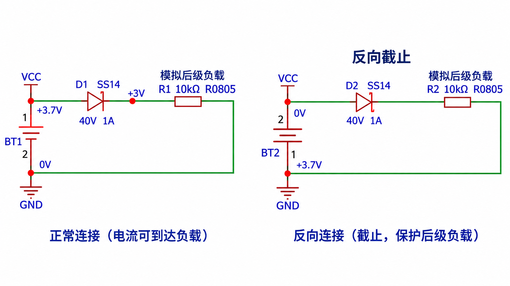
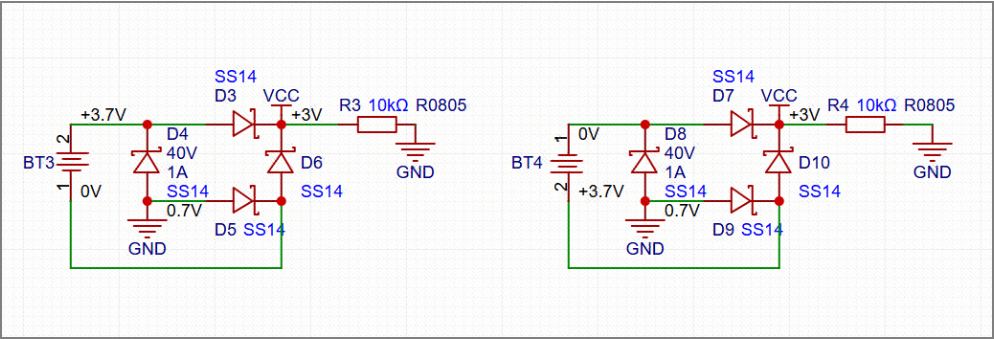
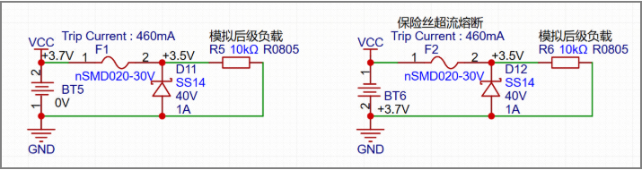
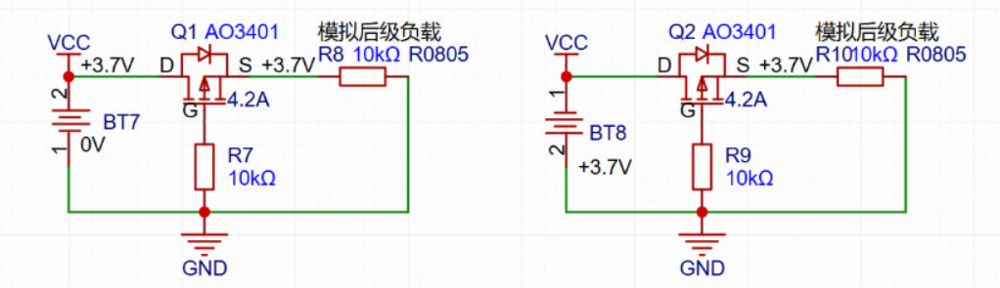
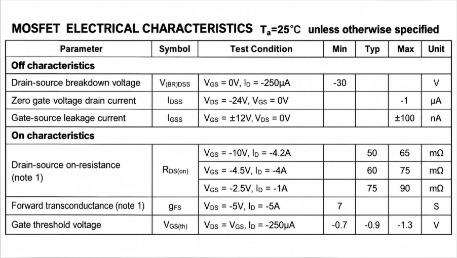

+++
date = '2026-10-09'
draft = false
title = '电源防反接电路分析'
math = true
+++

# 电源防反接电路分析
## 二极管（D1、D2） 防反接电路分析

- 正接：D1有压差，承担整个电路的电流
- 反接：D1会承受一个“反向电压”，相当于电阻无限大，承担电源电压
- 适用于：小电流、允许压降的防反接
- 不适用于：大电流、低电压、高效率、低功耗系统

## 整流桥 防反接电路分析

- 不管电路正常接入还是反向接入，都可以正常工作
- 全桥整流需要承受两个二极管的压降（正接D3+D5，反接D10+D8）
- 需要考虑负载电流的大小选择合适的二极管

查手册 

$$
I_{D1} = I_{D2} = I_{LOAD}
$$
$$
\text{假设}I_{LOAD}=500mA\text{时，}V_{F}=0.7v
$$
$
\text{此时}I_{D1}\text{为二极管需要考虑的负载电流，两个二极管的压降为}2\times V_{F}
$
\(I_{LOAD}\) 为负载电流

正导通电流路径： 
$$
\boxed{BT3(+) \rightarrow D3 \rightarrow VCC \rightarrow \text{负载} \rightarrow GND \rightarrow D5 \rightarrow BT3(-)}
$$

反接电流路径：
$$
\boxed{BT4(+) \rightarrow D10 \rightarrow VCC \rightarrow \text{负载} \rightarrow GND \rightarrow D8 \rightarrow BT4(-)}
$$

## 保险丝+二极管 防反接

- 电源正接时，整个负载电流全部经过保险丝，需要考虑后级负载电流大小
- 电源反接时，电流经过二极管流会保险丝，此时保险丝自身+二极管的电阻很小，电流会迅速增加熔断保险丝
- 二极管的持续电流要 **大于** 保险丝的跳闸电流，保护二极管

正接电流路径： 
$$
\boxed{BT5(+) \rightarrow F1 \rightarrow R5 \rightarrow GND \rightarrow BT5(-)}
$$

反接电流路径： 
$$
\boxed{BAT+ \rightarrow D \rightarrow PTC \rightarrow BAT-}
$$

计算电流：

1、正接：
$$
I_{LOAD} \approx \frac{V_{BAT}}{R_5}
$$
$$
\text{假设：}R_5=10\text{kΩ}\text{，}V_{BAT}=3.7v
$$
$$
I_{LOAD}\approx 0.37mA
$$
$$
I_{LOAD}\,\text{这个是非常小的电流，F1完全不会动作}
$$
2、反接：
$$
I_{FAULT} \approx \frac{V_{BAT}-V_F}{R_{BAT}+R_{PTC}+R_D+R_{wire}}
$$
$$
\text{假设：}\quad V_{BAT}=3.7\text{V},\quad V_F=0.4\text{V},\quad R_{BAT}+R_{PTC}+R_D+R_{wire}=1\,\Omega
$$
$$
I_{FAULT}\approx 3.3A \rightarrow \text{瞬间电流就可能非常大} \rightarrow \text{PTC开始发热}
$$

## Pmos 防反接电路分析（这里关乎mos管选型）

- AO3401的漏极D接输入端，源极S接负载端，栅极G通过10kΩ电阻接GND
- 正常供电时导通电阻较小，压降和功耗较低

正接：
上电时电流路径：（判断Pmos是否导通）
$$
\boxed{BT7(+) \rightarrow Q1\text{体二极管} \rightarrow R8 \rightarrow GND \rightarrow BT7(-)}
$$
计算上电时电流：
$$
\text{假设}V_D\approx 0.6v,\text{已知栅极接地，}V_G=0v
$$
$$
V_S\approx 3.7v-0.6v=3.1v
$$
$$
V_{GS}=V_G-V_S
$$
$$
V_{GS}\approx -3.1v
$$
$$
AO3401\text{是}P\text{沟道}MOSFET\text{，负的}V_{GS}\text{会使}MOSFET\text{开启}
$$

稳定时时电流路径：（Pmos导通）
$$
\boxed{BT7(+) \rightarrow Q1(D \rightarrow S) \rightarrow R8 \rightarrow GND \rightarrow BT7(-)}
$$
此时Q1的体二极管基本不再承担负载电流
由于正常供电时导通电阻较小，压降可以忽略

反接无电流路径：
$$
\boxed{BT8(+) \rightarrow GND \rightarrow R10 \times\;Q2(S \rightarrow D) \rightarrow BT8(-)}
$$
电源反接时几乎没有电流流过二极管 \(\rightarrow V_S=0v,栅极有绝缘层无电流\rightarrow V_G=0v \rightarrow V_{GS}=0v \rightarrow Pmos不导通\)

## Nmos 防反接电路分析
以 AO3400A（N 沟道 MOSFET）为例，电源电压为 3.7V，负载电阻为 10kΩ。

- NMOS 的源极 S 接负载负极，漏极 D 接电池负极，栅极 G 通过 10kΩ 电阻接电池正极。
- NMOS 采用低端防反接方式，与 PMOS 高端防反接方式不同。
- 正常供电时导通电阻较小，压降和功耗较低。
- 电源反接时，NMOS 截止，体二极管反向偏置，阻断负载电流。
- 注意：负载地与电池负极之间必须经过 NMOS，不能直接短接。

上电时电流路径（判断 NMOS 是否导通）
$$
\boxed{BT7(+)\rightarrow R8\rightarrow Q1\text{体二极管}(S\rightarrow D)\rightarrow BT7(-)}
$$
上电瞬间，NMOS 尚未形成导电沟道，电流可以先通过体二极管

计算上电时电流：

假设体二极管正向压降为：
$$
V_F\approx0.6V
$$

以电池负极为 0V 参考点：
$$
V_D=0V
$$
$$
V_S\approx0.6V
$$
已知栅极通过 10kΩ 电阻连接电池正极，MOSFET 栅极稳态电流近似为零：
$$
V_G\approx3.7V
$$
计算栅源电压：
$$
V_{GS}=V_G-V_S
$$
$$
V_{GS}\approx3.7-0.6=3.1V
$$
$$
\boxed{V_{GS}\approx3.1V}
$$
AO3400A 是 N 沟道 MOSFET，正的 \(V_{GS}\) 达到足够幅值时会使 MOSFET 开启。
$$
\boxed{V_{GS}>V_{GS(th)}\Rightarrow NMOS\text{开始导通}}
$$

稳定时电流路径（NMOS 导通）：
$$
\boxed{BT7(+)\rightarrow R8\rightarrow Q1(S\rightarrow D)\rightarrow BT7(-)}
$$
此时 Q1 的体二极管基本不再承担负载电流

由于 NMOS 导通电阻较小，源极与漏极之间的电压差很小：
$$
V_S\approx V_D\approx0V
$$
$$
V_{GS}=V_G-V_S
$$
$$
\boxed{V_{GS}\approx3.7V}
$$
假设负载电阻为：
$$
R8=10k\Omega
$$
忽略 MOSFET 导通压降，负载电流为：
$$
I=\frac{U}{R}
$$
$$
I=\frac{3.7}{10000}=0.00037A
$$
$$
\boxed{I\approx0.37mA}
$$
MOSFET 导通压降的大小为：
$$
|V_{DS}|=I\times R_{DS(on)}
$$
MOSFET 导通损耗为：
$$
P=I^2R_{DS(on)}
$$
由于正常供电时导通电阻较小，因此压降和功耗都较低。

反接：

反接时电流路径：
$$
\boxed{BT8(+)\rightarrow Q2(D\rightarrow S)\;\times\; R10\rightarrow BT8(-)}
$$
电源反接后，NMOS 的体二极管处于反向偏置状态，无法形成正常负载电流回路

\(\times\) 表示电流路径被阻断

判断 NMOS 是否导通：

以反接后的电池正极为 0V 参考点：
$$
V_D=0V
$$
反接时体二极管截止，负载电流近似为零

由于负载电阻 R10 两端没有明显压降，因此源极电位近似等于反接后的电池负极电位：
$$
V_S\approx-3.7V
$$
栅极通过 10kΩ 电阻连接原电池正极节点，该节点在反接后对应电池负极

由于 MOSFET 栅极绝缘，稳态栅极电流近似为零：
$$
V_G\approx-3.7V
$$
计算栅源电压：
$$
V_{GS}=V_G-V_S
$$
$$
V_{GS}\approx-3.7-(-3.7)
$$
$$
\boxed{V_{GS}\approx0V}
$$
NMOS 需要足够的正向栅源电压才能导通

此时，MOSFET 处于截止状态；同时，NMOS 的体二极管反向偏置，因此无法形成完整的负载电流回路
$$
\boxed{I_{\text{load}}\approx0}
$$
反接时：
电源极性反转 → 体二极管反向偏置 → 负载电流近似为零 → 源极电位接近栅极电位 → \(V_{GS}\approx0V\) → NMOS 截止

